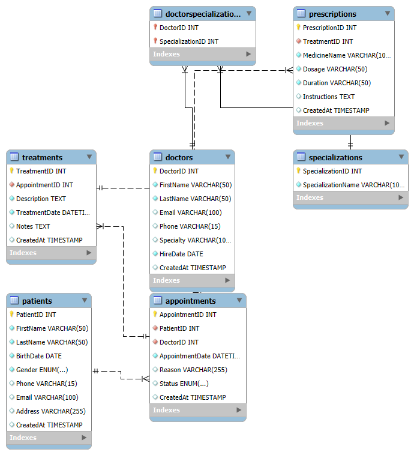

# Hertz Clinic Booking System

## Description

The Hertz Clinic Booking System is a full-featured database management system designed using MySQL. This system manages patient records, doctor information, appointments, treatments, and prescriptions to streamline the booking and treatment process in Hertz Clinic. The database includes relationships among several entities and enforces data integrity through proper constraints (primary keys, foreign keys, unique constraints, and not null constraints).

Key features include:
- Patient registration and record management.
- Doctor profiles with specialty details.
- Appointment scheduling with conflict prevention (unique doctor booking for the same time).
- Tracking treatments and linking them to appointments.
- Handling prescription details related to treatments.
- Support for many-to-many relationships between doctors and specialties for extended functionality.

## Setup / How to Run

To set up the Hertz Clinic Booking System on your MySQL server, follow these steps:

1. **Install MySQL Server:**  
   Make sure that MySQL is installed on your system. You can download it from the [MySQL website](https://dev.mysql.com/downloads/mysql/).

2. **Obtain the SQL Script:**  
   Download or clone the project repository to get the SQL script that creates the complete database schema.

3. **Import the SQL Script:**
   - Open your MySQL client (such as MySQL Workbench, phpMyAdmin, or command-line interface).
   - Execute the SQL script file (`ClinicDB.sql`). For example, if using the MySQL command-line:
     ```bash
     mysql -u [username] -p < path/to/ClinicDB.sql
     ```
   - Replace `[username]` with your MySQL username and adjust the path to where your `ClinicDB.sql` file is located.

4. **Verify Installation:**  
   Once imported, list the databases or use the `ClinicDB` database to check that the tables and relationships have been correctly created. You can run:
   ```sql
   SHOW TABLES;


ERD (Entity Relationship Diagram)
Below is a simplified illustration of the ERD for the Hertz Clinic Booking System. Please refer to the attached screenshot in the repository.

Screenshot:


Contact:
For suggestions, improvements, or bug reports, please contact [Suliat Said] at [ummelbanaat@duck.com].

Enjoy working with Hertz Clinic Booking System, and feel free to contribute or suggest improvements!
